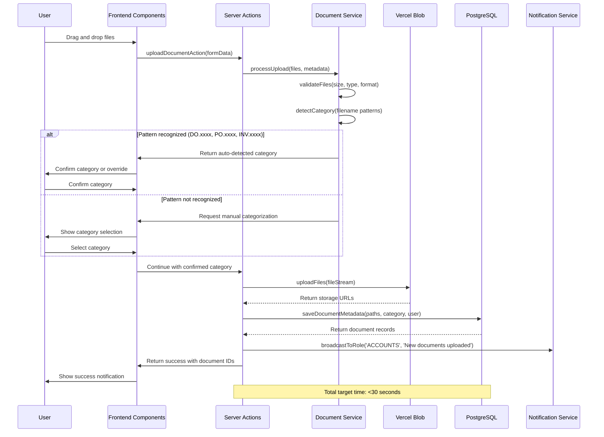
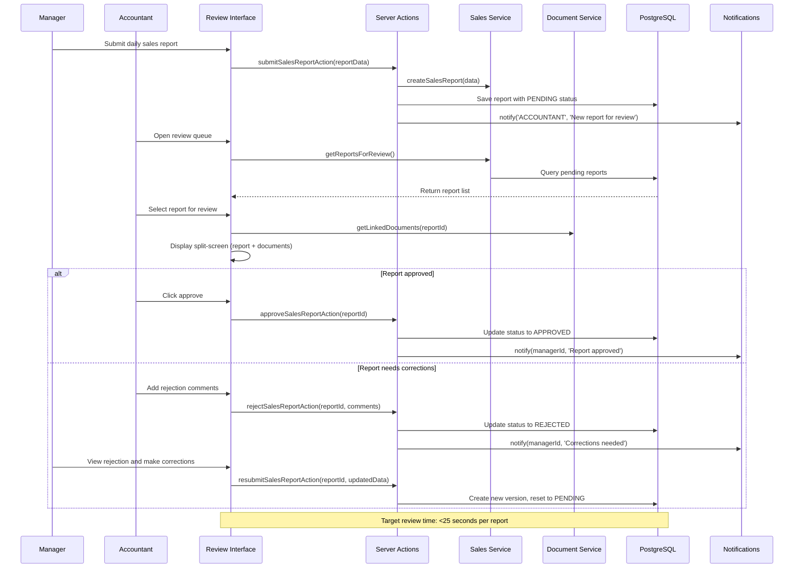

# Reliability Maldives Business Management System Fullstack Architecture Document

This document outlines the complete fullstack architecture for Reliability Maldives Business Management System, including backend systems, frontend implementation, and their integration. It serves as the single source of truth for AI-driven development, ensuring consistency across the entire technology stack.

This unified approach combines what would traditionally be separate backend and frontend architecture documents, streamlining the development process for modern fullstack applications where these concerns are increasingly intertwined.

## Starter Template or Existing Project

**Result:** Greenfield project with clear technology constraints

From your PRD, I can see you've specified:
- Next.js (v14+) with shadcn/ui (v4) 
- PostgreSQL (v15+) with Prisma (v5+)
- NextAuth.js (v4+) or Clerk for authentication
- Vercel deployment preference

This provides a clear technical foundation without needing a starter template.

## Change Log

| Date | Version | Description | Author |
|------|---------|-------------|--------|
| 2025-08-30 | 1.0 | Initial architecture creation from PRD and UX specification | Winston (Architect) |

## High Level Architecture

### Technical Summary

The Reliability Maldives Business Management System employs a **monolithic Next.js fullstack architecture** deployed on Vercel with PostgreSQL database. The system integrates **Next.js App Router with Server Components** for optimal performance, **shadcn/ui v4** for consistent business interfaces, and **Prisma ORM** for type-safe database operations. Key integration points include **Server Actions** for form processing, **NextAuth.js** for role-based authentication, and **real-time notifications** via Server-Sent Events. The architecture prioritizes **single-window workflows** and **30-second task completion** through optimized data fetching, drag-and-drop file uploads, and split-screen review interfaces that enable seamless coordination between Sales, Accounts, HR, and Management teams.

### Platform and Infrastructure Choice

**Platform:** Vercel  
**Key Services:** Neon PostgreSQL, Vercel Blob Storage, Vercel Analytics, Vercel KV (Redis)  
**Deployment Host and Regions:** Vercel Edge Network (Global CDN), Primary region: Singapore (closest to Maldives)

### Repository Structure

**Structure:** Monorepo with Next.js app structure  
**Monorepo Tool:** Not needed - using Next.js native structure with npm workspaces  
**Package Organization:** Feature-based with shared utilities

### High Level Architecture Diagram

```mermaid
graph TB
    U[Users - Web Browser] --> V[Vercel CDN/Edge]
    V --> N[Next.js App - Server Components]
    N --> A[Next.js API Routes]
    N --> C[Client Components - shadcn/ui]
    
    A --> P[(Neon PostgreSQL)]
    A --> B[Vercel Blob Storage]
    A --> Z[ZKT Machine SDK]
    A --> R[Vercel KV - Redis Cache]
    
    N --> SSE[Server-Sent Events]
    SSE --> C
    
    P --> PR[Prisma ORM]
    PR --> A
    
    V --> S[Vercel Analytics]
    N --> S
    
    subgraph "Authentication"
        A --> NA[NextAuth.js]
        NA --> P
    end
    
    subgraph "File Processing"
        C --> SA[Server Actions]
        SA --> B
        SA --> P
    end
    
    style N fill:#0066cc
    style P fill:#336699
    style V fill:#000
```



### Architectural Patterns

- **Fullstack React with Server Components:** Next.js App Router with Server Components for optimal performance and SEO - _Rationale:_ Enables server-side rendering with client-side interactivity, reducing JavaScript bundle size while maintaining rich UX for business workflows

- **Component-Based UI with Design System:** shadcn/ui components with consistent theming and variants - _Rationale:_ Provides professional business interface patterns while enabling rapid development and maintaining design consistency across all modules

- **Server Actions for Form Processing:** Next.js Server Actions for file uploads and form submissions - _Rationale:_ Eliminates API endpoint boilerplate while providing type-safe server-side processing for business document workflows

- **Repository Pattern with Prisma:** Abstract data access through service layers using Prisma ORM - _Rationale:_ Enables type-safe database operations while maintaining testability and future migration flexibility for business data

- **Role-Based Access Control (RBAC):** Centralized permission system with middleware protection - _Rationale:_ Essential for multi-team coordination ensuring Sales, Accounts, HR, and Management access appropriate functions only

- **Single-Window Interface Pattern:** Related functionality grouped in unified interfaces with contextual sub-tabs - _Rationale:_ Achieves 30-second task completion target by eliminating navigation overhead between related business functions

## Tech Stack

| Category | Technology | Version | Purpose | Rationale |
|----------|------------|---------|---------|-----------|
| Frontend Language | TypeScript | 5.0+ | Type-safe development | Essential for business logic correctness and team collaboration |
| Frontend Framework | Next.js | 14+ | Fullstack React framework | App Router, Server Components, and Server Actions align with architecture needs |
| UI Component Library | shadcn/ui | v4 | Professional business UI | Provides consistent, accessible components with excellent TypeScript support |
| State Management | Zustand | 4.4+ | Client state management | Lightweight, TypeScript-first state management for form data and UI state |
| Backend Language | TypeScript | 5.0+ | Unified language stack | Single language across frontend/backend reduces cognitive overhead |
| Backend Framework | Next.js API Routes | 14+ | Serverless API endpoints | Integrated with frontend, automatic deployment, type sharing |
| API Style | Server Actions + REST | Next.js native | Form processing + data fetching | Server Actions for mutations, REST for complex queries and external integrations |
| Database | PostgreSQL | 15+ | Production database | ACID compliance for financial data, excellent Prisma integration |
| Cache | Vercel KV (Redis) | Latest | Session and data caching | Fast session storage and API response caching |
| File Storage | Vercel Blob | Latest | Document storage | Integrated blob storage with CDN for business documents |
| Authentication | NextAuth.js | v4+ | Role-based auth system | Mature authentication with built-in providers and session management |
| Frontend Testing | Jest + Testing Library | 29+/13+ | Component and unit testing | Standard React testing tools with excellent TypeScript support |
| Backend Testing | Jest + Supertest | 29+/6+ | API and integration testing | Comprehensive testing for Server Actions and API routes |
| E2E Testing | Playwright | 1.38+ | Full workflow testing | Cross-browser testing for business workflows |
| Build Tool | Next.js | 14+ | Integrated build system | Zero-config builds with optimization for Vercel deployment |
| Bundler | Turbopack | Next.js native | Development bundler | Fastest development builds for complex business applications |
| IaC Tool | None | - | Vercel handles infrastructure | Vercel's zero-config deployment eliminates IaC complexity |
| CI/CD | GitHub Actions | Latest | Automated deployment | Integrated with Vercel for seamless deployment pipeline |
| Monitoring | Vercel Analytics | Latest | Performance monitoring | Built-in performance and user analytics |
| Logging | Vercel Functions | Latest | Application logging | Integrated logging with Vercel's serverless functions |
| CSS Framework | Tailwind CSS | 3.3+ | Utility-first styling | Included with shadcn/ui, enables rapid consistent styling |

## Data Models

### User

**Purpose:** Authentication and role-based access control for all system users across Sales, Accounts, HR, and Management teams

**Key Attributes:**
- id: string - Unique identifier for user records
- email: string - Primary authentication credential and contact
- name: string - Display name for user interface and notifications
- role: UserRole - Determines system access and workflow permissions
- isActive: boolean - Account status for deactivation without deletion
- createdAt: Date - Account creation timestamp for audit trails
- updatedAt: Date - Last modification for security monitoring

#### TypeScript Interface
```typescript
interface User {
  id: string;
  email: string;
  name: string;
  role: UserRole;
  isActive: boolean;
  createdAt: Date;
  updatedAt: Date;
  
  // Relationships
  uploadedDocuments: Document[];
  followUps: FollowUp[];
  salesReports: SalesReport[];
  attendanceOverrides: AttendanceRecord[];
}

enum UserRole {
  ADMIN = 'ADMIN',
  SALES = 'SALES', 
  ACCOUNTS = 'ACCOUNTS',
  MANAGER = 'MANAGER',
  ACCOUNTANT = 'ACCOUNTANT'
}
```

#### Relationships
- One-to-many with Document (uploaded files tracking)
- One-to-many with FollowUp (customer interaction logging)
- One-to-many with SalesReport (report submission tracking)
- One-to-many with AttendanceRecord (manual override audit trail)

### Customer

**Purpose:** Central customer database supporting receivables management and cross-team coordination

**Key Attributes:**
- id: string - Unique customer identifier for all business transactions
- name: string - Customer business or individual name for invoices and statements
- email: string - Primary contact for automated notifications and statements
- phone: string - Secondary contact for follow-up calls and coordination
- address: string - Business address for formal correspondence and delivery
- paymentTerms: number - Standard payment terms in days for due date calculations
- currentBalance: Decimal - Real-time balance for dashboard alerts and statements
- isActive: boolean - Customer status for account management

#### TypeScript Interface
```typescript
interface Customer {
  id: string;
  name: string;
  email: string | null;
  phone: string | null;
  address: string | null;
  paymentTerms: number; // days
  currentBalance: Decimal;
  isActive: boolean;
  createdAt: Date;
  updatedAt: Date;
  
  // Relationships
  receivables: Receivable[];
  followUps: FollowUp[];
  documents: Document[];
}
```

#### Relationships
- One-to-many with Receivable (invoice and payment tracking)
- One-to-many with FollowUp (customer interaction history)
- One-to-many with Document (customer-specific document storage)

### Document

**Purpose:** Unified file storage system supporting automatic categorization and cross-module document linking

**Key Attributes:**
- id: string - Unique document identifier for database relationships
- originalName: string - User-uploaded filename for reference and search
- storedPath: string - Vercel Blob storage path for file retrieval
- category: DocumentCategory - Automatic categorization based on naming patterns
- fileSize: number - File size in bytes for storage management and validation
- mimeType: string - File type for security validation and preview capabilities
- uploadedById: string - User accountability for document uploads
- linkedToCustomerId: string - Customer relationship for document organization

#### TypeScript Interface
```typescript
interface Document {
  id: string;
  originalName: string;
  storedPath: string;
  category: DocumentCategory;
  fileSize: number;
  mimeType: string;
  uploadedById: string;
  linkedToCustomerId: string | null;
  linkedToReceivableId: string | null;
  linkedToSalesReportId: string | null;
  createdAt: Date;
  
  // Relationships
  uploadedBy: User;
  linkedToCustomer?: Customer;
  linkedToReceivable?: Receivable;
  linkedToSalesReport?: SalesReport;
}

enum DocumentCategory {
  INVOICE = 'INVOICE',        // INV.xxxx/xx pattern
  PURCHASE_ORDER = 'PURCHASE_ORDER',  // PO.xxxx/xx pattern  
  DELIVERY_ORDER = 'DELIVERY_ORDER',  // DO.xxxx/xx pattern
  SALES_RECEIPT = 'SALES_RECEIPT',
  OTHER = 'OTHER'
}
```

#### Relationships
- Many-to-one with User (upload accountability)
- Many-to-one with Customer (document organization)
- Many-to-one with Receivable (supporting documentation)
- Many-to-one with SalesReport (sales verification documents)

### Receivable

**Purpose:** Invoice and payment tracking system enabling coordinated follow-up between Sales and Accounts teams

**Key Attributes:**
- id: string - Unique receivable identifier for payment tracking
- invoiceNumber: string - Business invoice number for customer reference
- customerId: string - Customer relationship for balance calculations
- amount: Decimal - Invoice amount for payment tracking and statements
- invoiceDate: Date - Invoice creation date for aging calculations
- dueDate: Date - Payment due date for automatic follow-up notifications
- paidAmount: Decimal - Partial payment tracking for accurate balance calculations
- status: ReceivableStatus - Current state for workflow management
- assignedTo: UserRole - Team responsibility for follow-up coordination

#### TypeScript Interface
```typescript
interface Receivable {
  id: string;
  invoiceNumber: string;
  customerId: string;
  amount: Decimal;
  invoiceDate: Date;
  dueDate: Date;
  paidAmount: Decimal;
  status: ReceivableStatus;
  assignedTo: UserRole;
  createdAt: Date;
  updatedAt: Date;
  
  // Relationships
  customer: Customer;
  followUps: FollowUp[];
  documents: Document[];
}

enum ReceivableStatus {
  PENDING = 'PENDING',
  PARTIALLY_PAID = 'PARTIALLY_PAID',
  PAID = 'PAID',
  OVERDUE = 'OVERDUE',
  DISPUTED = 'DISPUTED'
}
```

#### Relationships
- Many-to-one with Customer (invoice grouping)
- One-to-many with FollowUp (payment collection history)
- One-to-many with Document (invoice and supporting files)

## API Specification

### Next.js Server Actions (Primary)

Server Actions handle form submissions and mutations with type safety:

```typescript
// Server Actions for form processing (app/lib/actions.ts)

// Document Upload Action
export async function uploadDocumentAction(formData: FormData): Promise<ActionResult<Document>> {
  const files = formData.getAll('files') as File[];
  const customerId = formData.get('customerId') as string;
  const category = formData.get('category') as DocumentCategory;
  
  try {
    // File validation, storage, and database insertion
    const documents = await uploadDocuments(files, customerId, category);
    revalidatePath('/documents');
    return { success: true, data: documents };
  } catch (error) {
    return { success: false, error: error.message };
  }
}

// Customer Follow-up Action
export async function createFollowUpAction(formData: FormData): Promise<ActionResult<FollowUp>> {
  const customerId = formData.get('customerId') as string;
  const notes = formData.get('notes') as string;
  const followUpType = formData.get('type') as FollowUpType;
  
  try {
    const followUp = await createFollowUp({ customerId, notes, followUpType });
    revalidatePath(`/customers/${customerId}`);
    return { success: true, data: followUp };
  } catch (error) {
    return { success: false, error: error.message };
  }
}

// Sales Report Submission Action
export async function submitSalesReportAction(formData: FormData): Promise<ActionResult<SalesReport>> {
  const outletId = formData.get('outletId') as string;
  const date = new Date(formData.get('date') as string);
  const cashAmount = parseFloat(formData.get('cashAmount') as string);
  const cardAmount = parseFloat(formData.get('cardAmount') as string);
  
  try {
    const report = await submitSalesReport({ outletId, date, cashAmount, cardAmount });
    revalidatePath('/sales-reports');
    return { success: true, data: report };
  } catch (error) {
    return { success: false, error: error.message };
  }
}

type ActionResult<T> = {
  success: true;
  data: T;
} | {
  success: false;
  error: string;
}
```

### REST API Routes (Secondary)

REST endpoints for data fetching and complex operations documented with OpenAPI 3.0 specification for customer management, receivables dashboard, sales report review, and ZKT attendance integration endpoints.

## Components

### Authentication Service

**Responsibility:** Role-based authentication and session management for Sales, Accounts, HR, and Management teams with NextAuth.js integration

**Key Interfaces:**
- `signIn(credentials)` - Email/password authentication with role assignment
- `getSession()` - Current user session with role permissions  
- `requireRole(role)` - Middleware for route protection based on user roles
- `signOut()` - Session cleanup and redirect handling

**Dependencies:** NextAuth.js, PostgreSQL (user storage), Vercel KV (session cache)

**Technology Stack:** NextAuth.js v4+ with database adapter, bcrypt for password hashing, JWT tokens with role claims

### Document Management Service

**Responsibility:** Unified file upload, categorization, and storage system supporting drag-and-drop workflows and automatic document linking

**Key Interfaces:**
- `uploadFiles(files, metadata)` - Process multiple file uploads with validation
- `categorizeDocument(filename)` - Automatic pattern recognition (DO.xxxx, PO.xxxx, INV.xxxx)
- `linkDocumentToEntity(docId, entityId, entityType)` - Connect documents to customers/receivables/reports
- `generatePreviewUrl(docId)` - Secure document preview URLs

**Dependencies:** Vercel Blob Storage, PostgreSQL (metadata), Authentication Service (user tracking)

**Technology Stack:** Vercel Blob API, Server Actions for upload processing, React Dropzone for frontend, sharp for image processing

### Customer Management Service

**Responsibility:** Customer database operations, statement generation, and cross-team coordination for receivables management

**Key Interfaces:**
- `createCustomer(customerData)` - New customer registration with validation
- `generateStatement(customerId, dateRange)` - PDF statement creation with transaction history
- `getCustomerBalance(customerId)` - Real-time balance calculation from receivables
- `searchCustomers(query, filters)` - Advanced customer search with pagination

**Dependencies:** PostgreSQL (customer data), Document Management (statement files), PDF generation library

**Technology Stack:** Prisma ORM for database operations, react-pdf or Puppeteer for PDF generation, Zod for validation

### Receivables Workflow Service

**Responsibility:** Invoice tracking, payment management, and automated follow-up coordination between Sales and Accounts teams

**Key Interfaces:**
- `createReceivable(invoiceData)` - New invoice entry with automatic due date calculation
- `recordPayment(receivableId, amount, date)` - Payment processing with balance updates
- `getOverdueAccounts(teamRole)` - Role-specific overdue account lists
- `scheduleFollowUp(receivableId, date, notes)` - Follow-up planning with notifications

**Dependencies:** Customer Management Service, Notification Service, Authentication Service (role-based access)

**Technology Stack:** Prisma ORM with transaction support, cron jobs for due date checks, Server Actions for form processing

### Sales Report Workflow Service

**Responsibility:** Daily sales report submission, approval workflows, and correction cycle management between Managers and Accountants

**Key Interfaces:**
- `submitReport(outletId, date, salesData)` - Manager report submission with duplicate prevention
- `getReportsForReview(accountantId)` - Pending reports queue with supporting documents
- `approveReport(reportId, comments)` - Accountant approval with notification to manager
- `rejectReport(reportId, corrections)` - Rejection with specific correction requirements

**Dependencies:** Document Management Service (supporting files), Authentication Service (role verification), Notification Service

**Technology Stack:** Prisma with unique constraints, Server Actions for form processing, shadcn/ui for split-screen review interface

### HR Attendance Service

**Responsibility:** ZKT machine integration, attendance data processing, and payroll preparation workflow coordination

**Key Interfaces:**
- `fetchZKTData(dateRange)` - Manual and scheduled ZKT data retrieval
- `processAttendanceData(rawData)` - Data validation and employee matching
- `applyManualOverride(employeeId, date, correction)` - Admin attendance adjustments with audit trail
- `finalizeAttendanceForPayroll(periodId)` - Lock attendance data for payroll processing

**Dependencies:** ZKT Machine SDK, Authentication Service (admin permissions), PostgreSQL (attendance storage)

**Technology Stack:** ZKT SDK integration via Next.js API routes, cron jobs for daily sync, Prisma for data persistence

### Notification Service

**Responsibility:** Real-time cross-team notifications, due date alerts, and workflow status updates using Server-Sent Events

**Key Interfaces:**
- `sendNotification(userId, message, type)` - Direct user notification with persistence
- `broadcastToRole(role, message)` - Role-based team notifications
- `scheduleAlert(entityId, alertDate, message)` - Automated due date and follow-up alerts
- `getNotificationStream(userId)` - SSE connection for real-time updates

**Dependencies:** Authentication Service (user/role targeting), Vercel KV (notification queue), PostgreSQL (notification persistence)

**Technology Stack:** Server-Sent Events via Next.js API routes, Vercel KV for message queue, React hooks for frontend integration

### PDF Generation Service

**Responsibility:** Professional document generation for customer statements, follow-up logs, and payroll exports with company branding

**Key Interfaces:**
- `generateCustomerStatement(customerId, options)` - Branded customer statements with transaction history
- `exportFollowUpLog(customerId, dateRange)` - Customer communication history reports
- `generatePayrollReport(periodId, employees)` - Payroll summary with attendance details
- `applyCompanyBranding(pdfBuffer)` - Consistent company letterhead and formatting

**Dependencies:** Customer Management Service, Receivables Service, HR Service (data sources)

**Technology Stack:** react-pdf for client-side generation or Puppeteer for server-side, company logo and template assets

## External APIs

### ZKT Machine API

- **Purpose:** Automated staff attendance data retrieval for payroll processing workflow
- **Documentation:** [User must provide ZKT SDK documentation - version and API specs unknown from PRD]
- **Base URL(s):** Local network machine IP addresses (typically 192.168.x.x range)
- **Authentication:** Machine-specific authentication (SDK dependent)
- **Rate Limits:** Unknown - requires ZKT documentation review

**Key Endpoints Used:**
- `GET /attendance/data` - Fetch attendance records by date range
- `GET /employees` - Retrieve employee list and ID mapping
- `POST /test-connection` - Verify machine connectivity

**Integration Notes:** The PRD identifies this as a high technical risk area requiring early investigation. The ZKT SDK integration will be wrapped in a service layer to abstract machine-specific details and provide fallback manual entry capabilities.

## Core Workflows

### Document Upload and Categorization Workflow



### Sales Report Review and Approval Workflow



## Database Schema

PostgreSQL schema optimized for business workflows and performance:

```sql
-- Enable UUID extension for primary keys
CREATE EXTENSION IF NOT EXISTS "uuid-ossp";

-- User roles enum
CREATE TYPE user_role AS ENUM ('ADMIN', 'SALES', 'ACCOUNTS', 'MANAGER', 'ACCOUNTANT');

-- Document categories enum
CREATE TYPE document_category AS ENUM ('INVOICE', 'PURCHASE_ORDER', 'DELIVERY_ORDER', 'SALES_RECEIPT', 'OTHER');

-- Receivable status enum
CREATE TYPE receivable_status AS ENUM ('PENDING', 'PARTIALLY_PAID', 'PAID', 'OVERDUE', 'DISPUTED');

-- Users table with role-based access
CREATE TABLE users (
    id UUID PRIMARY KEY DEFAULT uuid_generate_v4(),
    email VARCHAR(255) UNIQUE NOT NULL,
    name VARCHAR(255) NOT NULL,
    password_hash VARCHAR(255) NOT NULL,
    role user_role NOT NULL,
    is_active BOOLEAN DEFAULT true,
    created_at TIMESTAMP WITH TIME ZONE DEFAULT NOW(),
    updated_at TIMESTAMP WITH TIME ZONE DEFAULT NOW()
);

-- Customers table with payment tracking
CREATE TABLE customers (
    id UUID PRIMARY KEY DEFAULT uuid_generate_v4(),
    name VARCHAR(255) NOT NULL,
    email VARCHAR(255),
    phone VARCHAR(50),
    address TEXT,
    payment_terms INTEGER DEFAULT 30, -- days
    current_balance DECIMAL(15,2) DEFAULT 0.00,
    is_active BOOLEAN DEFAULT true,
    created_at TIMESTAMP WITH TIME ZONE DEFAULT NOW(),
    updated_at TIMESTAMP WITH TIME ZONE DEFAULT NOW()
);

-- Documents table with automatic categorization
CREATE TABLE documents (
    id UUID PRIMARY KEY DEFAULT uuid_generate_v4(),
    original_name VARCHAR(500) NOT NULL,
    stored_path VARCHAR(1000) NOT NULL,
    category document_category NOT NULL,
    file_size BIGINT NOT NULL,
    mime_type VARCHAR(100) NOT NULL,
    uploaded_by_id UUID NOT NULL REFERENCES users(id),
    linked_to_customer_id UUID REFERENCES customers(id),
    linked_to_receivable_id UUID REFERENCES receivables(id),
    linked_to_sales_report_id UUID REFERENCES sales_reports(id),
    created_at TIMESTAMP WITH TIME ZONE DEFAULT NOW(),
    
    -- Search optimization
    CONSTRAINT valid_file_size CHECK (file_size > 0 AND file_size <= 10485760) -- 10MB limit
);

-- Performance indexes for business queries
CREATE INDEX idx_customers_name_search ON customers USING gin(to_tsvector('english', name));
CREATE INDEX idx_customers_active ON customers(is_active) WHERE is_active = true;
CREATE INDEX idx_receivables_customer_status ON receivables(customer_id, status);
CREATE INDEX idx_receivables_due_date ON receivables(due_date) WHERE status IN ('PENDING', 'OVERDUE');
CREATE INDEX idx_documents_category_customer ON documents(category, linked_to_customer_id);

-- Additional tables for receivables, follow_ups, outlets, sales_reports, employees, 
-- attendance_records, notifications, and audit_logs follow similar patterns...
```

## Frontend Architecture

### Component Architecture

**Component Organization:**
```
src/
├── components/
│   ├── ui/                      # shadcn/ui base components
│   ├── business/                # Business-specific components
│   ├── forms/                   # Form components using Server Actions
│   └── layouts/                 # Page layout components
```

### State Management Architecture

Global state using Zustand for application state, React Query for server state management, and local useState for UI-specific state.

### Routing Architecture

Next.js App Router with route groups for authentication and protected dashboard routes, with middleware for role-based access control.

### Frontend Services Layer

API client setup with authentication handling and service abstractions for each business domain.

## Backend Architecture

### Service Architecture

Next.js API Routes with controller organization by business domain, comprehensive error handling, and role-based access validation.

### Database Architecture

Prisma ORM with repository pattern for data access abstraction and type-safe database operations.

### Authentication and Authorization

NextAuth.js integration with role-based middleware, session management, and comprehensive security features.

## Unified Project Structure

```
reliability-maldives/
├── .github/                          # CI/CD workflows
├── apps/
│   └── web/                          # Main Next.js application
│       ├── app/                      # Next.js App Router
│       ├── src/                      # Application source code
│       ├── public/                   # Static assets
│       ├── prisma/                   # Database schema and migrations
│       └── tests/                    # Application tests
├── packages/                         # Shared packages (if needed)
├── docs/                             # Documentation
├── scripts/                          # Build and deployment scripts
└── Configuration files
```

## Development Workflow

### Local Development Setup

**Prerequisites:** Node.js 18+, PostgreSQL, Git

**Initial Setup:**
```bash
# Clone and setup
git clone <repository>
npm install
cp .env.example .env.local
npx prisma generate && npx prisma db push
npm run dev
```

**Development Commands:**
- `npm run dev` - Start development server
- `npm run test` - Run test suite
- `npm run lint` - Code quality checks
- `npm run build` - Production build

### Environment Configuration

Comprehensive environment variables for database, authentication, file storage, caching, email, and ZKT integration.

## Deployment Architecture

### Deployment Strategy

**Frontend Deployment:** Vercel (Next.js native platform)  
**Backend Deployment:** Vercel Serverless Functions (integrated)  
**Database:** Neon PostgreSQL with automatic connection pooling

### CI/CD Pipeline

GitHub Actions workflow with:
- Automated testing (unit, integration, e2e)
- Code quality checks (lint, type-check)
- Automated deployment to staging and production
- Environment-specific configuration management

### Environments

| Environment | Frontend URL | Backend URL | Purpose |
|-------------|-------------|-------------|---------|
| Development | http://localhost:3000 | http://localhost:3000/api | Local development |
| Staging | https://staging.reliability-maldives.vercel.app | https://staging.reliability-maldives.vercel.app/api | Pre-production testing |
| Production | https://app.reliability-maldives.com | https://app.reliability-maldives.com/api | Live environment |

## Security and Performance

### Security Requirements

**Frontend Security:**
- CSP Headers for XSS prevention
- Secure token storage in HttpOnly cookies
- Input validation and sanitization

**Backend Security:**
- Role-based access control with middleware
- Rate limiting and CORS policies
- Comprehensive input validation with Zod schemas

**Authentication Security:**
- NextAuth.js with 2-hour session timeout
- Bcrypt password hashing
- JWT tokens with role claims

### Performance Optimization

**Frontend Performance:**
- Bundle size optimization with code splitting
- Image optimization with Next.js Image component
- Client-side caching with React Query

**Backend Performance:**
- Database query optimization with strategic indexes
- Connection pooling through Neon PostgreSQL
- API response caching with Vercel KV

## Testing Strategy

### Testing Pyramid

```
E2E Tests (Playwright)
/        \
Integration Tests (Jest + Supertest)  
/            \
Frontend Unit (Jest + Testing Library)  Backend Unit (Jest)
```

Comprehensive testing approach covering component testing, API testing, and end-to-end workflow validation.

## Coding Standards

### Critical Fullstack Rules

- **Type Sharing:** Always define types in packages/shared and import from there
- **API Calls:** Never make direct HTTP calls - use the service layer
- **Environment Variables:** Access only through config objects, never process.env directly
- **Error Handling:** All API routes must use the standard error handler
- **State Updates:** Never mutate state directly - use proper state management patterns

### Naming Conventions

| Element | Frontend | Backend | Example |
|---------|----------|---------|---------|
| Components | PascalCase | - | `UserProfile.tsx` |
| Hooks | camelCase with 'use' | - | `useAuth.ts` |
| API Routes | - | kebab-case | `/api/user-profile` |
| Database Tables | - | snake_case | `user_profiles` |

## Error Handling Strategy

Unified error handling across frontend and backend with:
- Standardized error response format
- Frontend error boundaries and user-friendly messages
- Backend error middleware with proper logging
- Comprehensive error flow documentation

## Monitoring and Observability

### Monitoring Stack

- **Frontend Monitoring:** Vercel Analytics for performance metrics
- **Backend Monitoring:** Vercel Functions monitoring
- **Error Tracking:** Built-in error logging and reporting
- **Performance Monitoring:** Core Web Vitals and API response tracking

### Key Metrics

**Frontend Metrics:**
- Core Web Vitals, JavaScript errors, API response times, User interactions

**Backend Metrics:**
- Request rate, Error rate, Response time, Database query performance

---

*This architecture document serves as the comprehensive technical foundation for the Reliability Maldives Business Management System, directly addressing all PRD requirements through a modern, scalable, and maintainable fullstack solution.*