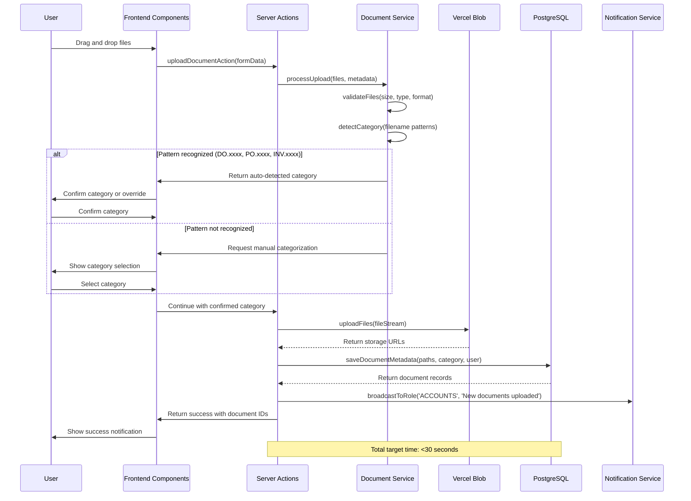
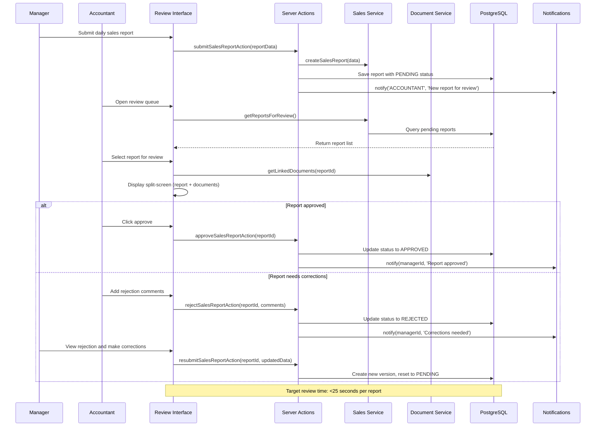

# Core Workflows

## Document Upload and Categorization Workflow

```mermaid
sequenceDiagram
    participant User
    participant UI as Frontend Components
    participant SA as Server Actions
    participant Doc as Document Service
    participant Blob as Vercel Blob
    participant DB as PostgreSQL
    participant Notif as Notification Service
    
    User->>UI: Drag and drop files
    UI->>SA: uploadDocumentAction(formData)
    SA->>Doc: processUpload(files, metadata)
    
    Doc->>Doc: validateFiles(size, type, format)
    Doc->>Doc: detectCategory(filename patterns)
    
    alt Pattern recognized (DO.xxxx, PO.xxxx, INV.xxxx)
        Doc->>UI: Return auto-detected category
        UI->>User: Confirm category or override
        User->>UI: Confirm category
    else Pattern not recognized
        Doc->>UI: Request manual categorization
        UI->>User: Show category selection
        User->>UI: Select category
    end
    
    UI->>SA: Continue with confirmed category
    SA->>Blob: uploadFiles(fileStream)
    Blob-->>SA: Return storage URLs
    
    SA->>DB: saveDocumentMetadata(paths, category, user)
    DB-->>SA: Return document records
    
    SA->>Notif: broadcastToRole('ACCOUNTS', 'New documents uploaded')
    SA->>UI: Return success with document IDs
    UI->>User: Show success notification
    
    Note over SA,DB: Total target time: <30 seconds
```

## Sales Report Review and Approval Workflow

```mermaid
sequenceDiagram
    participant Manager
    participant Accountant
    participant UI as Review Interface
    participant SA as Server Actions
    participant Sales as Sales Service
    participant Doc as Document Service
    participant DB as PostgreSQL
    participant Notif as Notifications
    
    Manager->>UI: Submit daily sales report
    UI->>SA: submitSalesReportAction(reportData)
    SA->>Sales: createSalesReport(data)
    SA->>DB: Save report with PENDING status
    SA->>Notif: notify('ACCOUNTANT', 'New report for review')
    
    Accountant->>UI: Open review queue
    UI->>Sales: getReportsForReview()
    Sales->>DB: Query pending reports
    DB-->>UI: Return report list
    
    Accountant->>UI: Select report for review
    UI->>Doc: getLinkedDocuments(reportId)
    UI->>UI: Display split-screen (report + documents)
    
    alt Report approved
        Accountant->>UI: Click approve
        UI->>SA: approveSalesReportAction(reportId)
        SA->>DB: Update status to APPROVED
        SA->>Notif: notify(managerId, 'Report approved')
    else Report needs corrections
        Accountant->>UI: Add rejection comments
        UI->>SA: rejectSalesReportAction(reportId, comments)
        SA->>DB: Update status to REJECTED
        SA->>Notif: notify(managerId, 'Corrections needed')
        
        Manager->>UI: View rejection and make corrections
        UI->>SA: resubmitSalesReportAction(reportId, updatedData)
        SA->>DB: Create new version, reset to PENDING
    end
    
    Note over UI,DB: Target review time: <25 seconds per report
```
