# High Level Architecture

## Technical Summary

The Reliability Maldives Business Management System employs a **monolithic Next.js fullstack architecture** deployed on Vercel with PostgreSQL database. The system integrates **Next.js App Router with Server Components** for optimal performance, **shadcn/ui v4** for consistent business interfaces, and **Prisma ORM** for type-safe database operations. Key integration points include **Server Actions** for form processing, **NextAuth.js** for role-based authentication, and **real-time notifications** via Server-Sent Events. The architecture prioritizes **single-window workflows** and **30-second task completion** through optimized data fetching, drag-and-drop file uploads, and split-screen review interfaces that enable seamless coordination between Sales, Accounts, HR, and Management teams.

## Platform and Infrastructure Choice

**Platform:** Vercel  
**Key Services:** Neon PostgreSQL, Vercel Blob Storage, Vercel Analytics, Vercel KV (Redis)  
**Deployment Host and Regions:** Vercel Edge Network (Global CDN), Primary region: Singapore (closest to Maldives)

## Repository Structure

**Structure:** Monorepo with Next.js app structure  
**Monorepo Tool:** Not needed - using Next.js native structure with npm workspaces  
**Package Organization:** Feature-based with shared utilities

## High Level Architecture Diagram

```mermaid
graph TB
    U[Users - Web Browser] --> V[Vercel CDN/Edge]
    V --> N[Next.js App - Server Components]
    N --> A[Next.js API Routes]
    N --> C[Client Components - shadcn/ui]
    
    A --> P[(Neon PostgreSQL)]
    A --> B[Vercel Blob Storage]
    A --> Z[ZKT Machine SDK]
    A --> R[Vercel KV - Redis Cache]
    
    N --> SSE[Server-Sent Events]
    SSE --> C
    
    P --> PR[Prisma ORM]
    PR --> A
    
    V --> S[Vercel Analytics]
    N --> S
    
    subgraph "Authentication"
        A --> NA[NextAuth.js]
        NA --> P
    end
    
    subgraph "File Processing"
        C --> SA[Server Actions]
        SA --> B
        SA --> P
    end
    
    style N fill:#0066cc
    style P fill:#336699
    style V fill:#000
```

## Architectural Patterns

- **Fullstack React with Server Components:** Next.js App Router with Server Components for optimal performance and SEO - _Rationale:_ Enables server-side rendering with client-side interactivity, reducing JavaScript bundle size while maintaining rich UX for business workflows

- **Component-Based UI with Design System:** shadcn/ui components with consistent theming and variants - _Rationale:_ Provides professional business interface patterns while enabling rapid development and maintaining design consistency across all modules

- **Server Actions for Form Processing:** Next.js Server Actions for file uploads and form submissions - _Rationale:_ Eliminates API endpoint boilerplate while providing type-safe server-side processing for business document workflows

- **Repository Pattern with Prisma:** Abstract data access through service layers using Prisma ORM - _Rationale:_ Enables type-safe database operations while maintaining testability and future migration flexibility for business data

- **Role-Based Access Control (RBAC):** Centralized permission system with middleware protection - _Rationale:_ Essential for multi-team coordination ensuring Sales, Accounts, HR, and Management access appropriate functions only

- **Single-Window Interface Pattern:** Related functionality grouped in unified interfaces with contextual sub-tabs - _Rationale:_ Achieves 30-second task completion target by eliminating navigation overhead between related business functions
