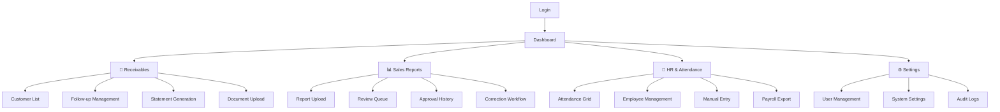
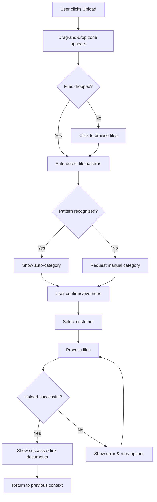
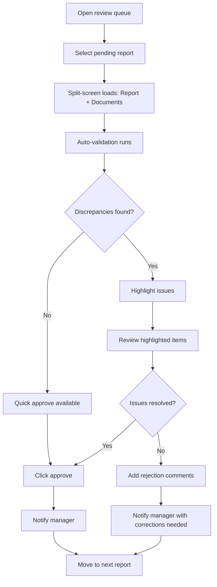
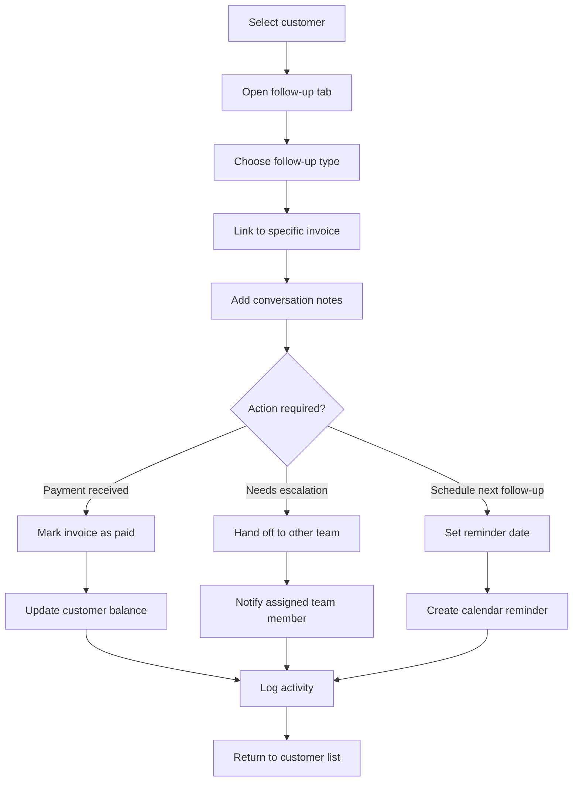

# Reliability Maldives Business Management System UI/UX Specification

## Introduction

This document defines the user experience goals, information architecture, user flows, and visual design specifications for **Reliability Maldives Business Management System's** user interface. It serves as the foundation for visual design and frontend development, ensuring a cohesive and user-centered experience.

The system transforms manual, paper-based processes into streamlined digital workflows across three core modules: Receivables & Customer Management, Sales Reports & Approval Workflow, and HR & Attendance Integration. The interface prioritizes 30-second task completion targets, single-window coordination between teams, and "everything in one place" accessibility for small company operations.

## Overall UX Goals & Principles

### Target User Personas

1. **Sales Team Member:** Field-focused professionals who need quick customer follow-up entry, document uploads, and handoff capabilities to Accounts. Values speed and mobile accessibility.

2. **Accounts Team Member:** Detail-oriented professionals who need comprehensive receivables review, approval workflows, and customer statement generation. Values accuracy and cross-reference capabilities.

3. **Outlet Manager:** Multi-location managers who need batch sales report uploads, correction workflows, and mobile accessibility during business travel. Values efficiency and error prevention.

4. **Accountant (Reviewer):** Analytical professionals who need split-screen document comparison, historical data analysis, and detailed approval workflows. Values thoroughness and validation tools.

5. **Admin (HR):** Administrative professionals who need attendance oversight, manual adjustments, and payroll coordination. Values control and audit capabilities.

### Usability Goals

- **30-second task completion:** Core workflows (upload, follow-up entry, approval) complete within target time
- **Single-window efficiency:** Eliminate navigation between screens for related tasks
- **Zero-training onboarding:** Interface patterns intuitive enough for immediate use
- **Cross-team coordination:** Clear handoff workflows without communication gaps
- **Mobile-first remote access:** Full functionality accessible during business travel

### Design Principles

1. **Speed over completeness** - Prioritize fast task completion with progressive enhancement
2. **Context over navigation** - Show related information in-place rather than requiring clicks
3. **Visual status clarity** - Use color and badges to communicate workflow states instantly
4. **Role-based optimization** - Customize interface elements for each user type's priorities
5. **Collaborative transparency** - Make cross-team activities visible to relevant stakeholders

### Change Log

| Date | Version | Description | Author |
|------|---------|-------------|--------|
| 2025-08-28 | 1.0 | Initial UI/UX specification creation from PRD and wireframe analysis | Sally (UX Expert) |

## Information Architecture (IA)

### Site Map / Screen Inventory

### Navigation Structure

**Primary Navigation:** Horizontal tab-based navigation at app header level with role-based visibility. Dashboard always visible, other modules appear based on user permissions (Sales/Accounts see Receivables, Managers see Sales Reports, Admin/Accounts see HR).

**Secondary Navigation:** Contextual sub-tabs within each module (e.g., Invoices/Follow-ups/Statements within Receivables). Action-oriented rather than data-oriented grouping.

**Breadcrumb Strategy:** Minimal breadcrumbs since most workflows are single-window. Primary context shown in page headers with clear "Back to Dashboard" links. Focus on "current task" indicators rather than hierarchical paths.

## User Flows

### Flow 1: Document Upload & Categorization

**User Goal:** Upload business documents (invoices, POs, delivery orders) and automatically link them to appropriate customer records

**Entry Points:** 
- Dashboard quick upload button
- Upload buttons within Receivables customer detail view  
- Bulk upload from main navigation

**Success Criteria:** Documents uploaded, categorized, and linked to customers within 30 seconds

#### Flow Diagram

#### Edge Cases & Error Handling:
- Network interruption during upload → Auto-resume with progress recovery
- Unrecognized file format → Clear error message with format requirements
- Large file size → Progress indicator with time estimates
- Duplicate filename → Automatic versioning with user confirmation
- Customer not found → Quick customer creation option

### Flow 2: Sales Report Review & Approval

**User Goal:** Accountant reviews daily sales reports with supporting documents and makes approval decisions

**Entry Points:**
- Dashboard pending review alerts
- Sales Reports module review queue
- Direct notification links

**Success Criteria:** Report reviewed and decision made within 25 seconds per report

#### Flow Diagram

#### Edge Cases & Error Handling:
- Missing supporting documents → Flag for manager with specific requirements
- Calculation errors → Automatic highlighting with correct values shown
- Historical comparison unavailable → Note limitation but allow review
- Manager corrections needed → Clear correction workflow with change tracking

### Flow 3: Customer Follow-up & Handoff

**User Goal:** Log customer interaction, update payment status, and coordinate between Sales and Accounts teams

**Entry Points:**
- Customer detail view follow-up tab
- Dashboard overdue payment alerts
- Quick follow-up action from notifications

**Success Criteria:** Follow-up logged and team notified within 20 seconds

#### Flow Diagram

#### Edge Cases & Error Handling:
- Team member unavailable → Queue for next available or escalate to supervisor
- Partial payment received → Split payment across multiple invoices
- Customer dispute → Flag for manager review with dispute tracking
- System offline during entry → Local storage with sync when connection restored

## Component Library / Design System

### Design System Approach

**Primary Framework:** shadcn/ui v4 as the foundational component library, providing consistent design tokens, accessibility compliance, and TypeScript support. This choice aligns with your Next.js architecture and ensures rapid development with professional UI patterns.

**Customization Strategy:** Extend shadcn/ui components with business-specific variants rather than creating entirely custom components. Focus on consistent styling tokens (colors, spacing, typography) while leveraging proven interaction patterns.

### Core Components

#### Business Data Card

**Purpose:** Display customer information, sales reports, and employee data in consistent card layouts throughout the application

**Variants:** 
- `customer-card` - Customer overview with status badges and quick actions
- `report-card` - Sales report summary with approval status
- `employee-card` - Staff information with attendance indicators

**States:** Default, Selected (border-primary), Loading (skeleton), Error (border-destructive)

**Usage Guidelines:** Always include status badge in header, limit actions to 2-3 primary buttons, maintain consistent spacing (p-4)

#### Status Badge System

**Purpose:** Provide immediate visual feedback for workflow states across all modules

**Variants:**
- `approved` (default/green) - Completed positive actions
- `pending` (secondary/gray) - Items awaiting action
- `rejected` (destructive/red) - Failed or rejected items
- `overdue` (destructive/red) - Time-critical items requiring attention
- `warning` (outline/amber) - Items needing manual attention

**States:** Static display only, no interactive states

**Usage Guidelines:** Always pair with descriptive text, use consistent positioning (top-right of cards), size="sm" for compact layouts

#### Upload Drop Zone

**Purpose:** Consistent file upload interface with drag-and-drop functionality across all modules

**Variants:**
- `standard` - Single file upload with preview
- `bulk` - Multiple file upload with progress tracking
- `categorized` - Upload with automatic categorization

**States:** Idle, Drag-over (border-primary), Uploading (progress indicator), Success (border-green), Error (border-red)

**Usage Guidelines:** Minimum height h-48, clear file type indicators, always show progress feedback

#### Split-Screen Panel

**Purpose:** Custom layout component for review workflows requiring document comparison

**Variants:**
- `review-layout` - 50/50 split for document review
- `detail-master` - 60/40 split for customer details
- `mobile-tabs` - Stacked tabs for mobile responsive

**States:** Loading (skeleton), Loaded, Resizing (user can adjust split)

**Usage Guidelines:** Include resize handle, collapse to single panel on mobile, maintain minimum widths

#### Team Coordination Bar

**Purpose:** Show real-time team status and cross-team notifications

**Variants:**
- `dashboard-status` - Team overview with online indicators
- `workflow-handoff` - Specific handoff actions between teams
- `notification-feed` - Live activity updates

**States:** Online (green), Busy (amber), Offline (gray), Alert (pulsing red)

**Usage Guidelines:** Always show current user context, limit notifications to actionable items, include clear timestamp information

## Branding & Style Guide

### Visual Identity

**Brand Guidelines:** Professional business application aesthetic focusing on clarity and efficiency over decorative elements. Clean interface that reduces cognitive load during repetitive daily tasks while maintaining Reliability Maldives corporate identity.

### Color Palette

| Color Type | Hex Code | Usage |
|------------|----------|-------|
| Primary | `#0f172a` (slate-900) | Main actions, navigation, primary buttons |
| Secondary | `#f8fafc` (slate-50) | Secondary buttons, subtle backgrounds |
| Accent | `#3b82f6` (blue-500) | Links, informational highlights, selected states |
| Success | `#059669` (emerald-600) | Approved states, positive confirmations, completed tasks |
| Warning | `#d97706` (amber-600) | Pending states, attention required, manual review needed |
| Error | `#dc2626` (red-600) | Rejected states, errors, overdue items |
| Neutral | `#64748b` (slate-500) | Text, borders, disabled states, metadata |

### Typography

#### Font Families
- **Primary:** Inter (clean, professional, excellent readability for business data)
- **Secondary:** Inter (consistent single font approach for simplicity)
- **Monospace:** JetBrains Mono (for file names, codes, technical data)

#### Type Scale

| Element | Size | Weight | Line Height |
|---------|------|---------|-------------|
| H1 | 2rem (32px) | 700 (Bold) | 1.2 |
| H2 | 1.5rem (24px) | 600 (Semi-bold) | 1.3 |
| H3 | 1.25rem (20px) | 600 (Semi-bold) | 1.4 |
| Body | 0.875rem (14px) | 400 (Regular) | 1.5 |
| Small | 0.75rem (12px) | 400 (Regular) | 1.4 |

### Iconography

**Icon Library:** Lucide React (consistent with shadcn/ui ecosystem, comprehensive business icon set, optimized for web)

**Usage Guidelines:** 
- Standard size: 16px (h-4 w-4) for inline actions
- Large size: 20px (h-5 w-5) for primary actions  
- Navigation size: 24px (h-6 w-6) for main navigation
- Consistent stroke width: 2px for visual harmony

### Spacing & Layout

**Grid System:** CSS Grid with 12-column layout for desktop, single column for mobile

**Spacing Scale:**
- xs: 4px (0.25rem) - Fine details, icon spacing
- sm: 8px (0.5rem) - Element margins  
- md: 16px (1rem) - Standard component spacing
- lg: 24px (1.5rem) - Section spacing
- xl: 32px (2rem) - Page-level spacing
- 2xl: 48px (3rem) - Major section breaks

## Accessibility Requirements

### Compliance Target

**Standard:** WCAG 2.1 AA compliance ensuring usability across different capabilities and devices, particularly important for small company environment where staff may have varying technical comfort levels.

### Key Requirements

**Visual:**
- Color contrast ratios: 4.5:1 minimum for normal text, 3:1 for large text and interactive elements
- Focus indicators: 2px solid blue outline on all focusable elements, visible against all backgrounds
- Text sizing: Minimum 14px (0.875rem) for body text, scalable to 200% without horizontal scrolling

**Interaction:**
- Keyboard navigation: Full functionality accessible via keyboard, logical tab order, skip links for main content areas
- Screen reader support: Semantic HTML, ARIA labels for complex interactions, live regions for dynamic content
- Touch targets: Minimum 44px tap targets for mobile interfaces, adequate spacing between interactive elements

**Content:**
- Alternative text: Descriptive alt text for all images and icons, empty alt="" for decorative elements
- Heading structure: Logical hierarchy (h1→h2→h3), no skipped levels, descriptive heading text
- Form labels: Clear labels associated with all form controls, error messages linked to relevant fields

### Testing Strategy

Manual testing with keyboard navigation, automated accessibility scanning with axe-core, screen reader testing with NVDA/JAWS, color blindness simulation, and mobile accessibility validation.

## Responsiveness Strategy

### Breakpoints

| Breakpoint | Min Width | Max Width | Target Devices |
|------------|-----------|-----------|----------------|
| Mobile | 320px | 767px | Phones, small tablets |
| Tablet | 768px | 1023px | Tablets, small laptops |
| Desktop | 1024px | 1439px | Laptops, desktop monitors |
| Wide | 1440px | - | Large monitors, ultrawide displays |

### Adaptation Patterns

**Layout Changes:** Desktop split-screen layouts convert to tabbed interfaces on mobile, sidebar navigation becomes slide-out drawer, grid layouts stack to single columns below 768px

**Navigation Changes:** Primary navigation collapses to hamburger menu on mobile, secondary tabs become swipeable on small screens, breadcrumbs hide on mobile with back button navigation

**Content Priority:** Hide non-essential metadata on mobile, prioritize primary actions in limited screen space, use progressive disclosure for complex forms

**Interaction Changes:** Replace hover states with touch-optimized interactions, increase touch target sizes to 44px minimum, implement swipe gestures for tab navigation on mobile

## Animation & Micro-interactions

### Motion Principles

Subtle, purposeful animations that enhance usability without distraction. Focus on state transitions, loading feedback, and spatial orientation rather than decorative effects. Respect user motion preferences with `prefers-reduced-motion` support.

### Key Animations

- **Page Transitions:** Fade in content (Duration: 200ms, Easing: ease-out)
- **Upload Progress:** Linear progress bar with pulse effect (Duration: continuous, Easing: linear)
- **Status Changes:** Badge color transitions (Duration: 150ms, Easing: ease-in-out)  
- **Modal Appearance:** Scale up from 95% with backdrop fade (Duration: 300ms, Easing: ease-out)
- **Notification Toast:** Slide in from right (Duration: 250ms, Easing: ease-out)
- **Hover Feedback:** Subtle scale to 102% on interactive elements (Duration: 100ms, Easing: ease-in-out)

## Performance Considerations

### Performance Goals

- **Page Load:** Initial page render under 2 seconds on 3G connection
- **Interaction Response:** UI feedback within 100ms of user action
- **Animation FPS:** Maintain 60fps for all animations and transitions

### Design Strategies

Lazy loading for non-critical content, optimized image formats (WebP/AVIF), minimal animation usage with CSS transforms, component-level code splitting, and progressive enhancement for advanced features.

## Next Steps

### Immediate Actions

1. **Stakeholder Review & Approval** - Present this UI/UX specification to company leadership and key users for validation and feedback incorporation
2. **Create Figma Design Library** - Build detailed visual designs based on these specifications using shadcn/ui v4 components as foundation
3. **Technical Architecture Handoff** - Collaborate with Design Architect to translate UX requirements into detailed frontend architecture specifications
4. **Component Prototype Development** - Build interactive prototypes of key components (upload zone, split-screen review, status workflows) for early user testing

### Design Handoff Checklist

- ✅ All user flows documented with timing targets and error handling
- ✅ Component inventory complete with variants and usage guidelines  
- ✅ Accessibility requirements defined with WCAG 2.1 AA compliance targets
- ✅ Responsive strategy clear with mobile-first approach and breakpoint specifications
- ✅ Brand guidelines incorporated with professional business application aesthetic
- ✅ Performance goals established with 30-second task completion optimization

---

*This UI/UX specification serves as the comprehensive foundation for implementing the Reliability Maldives Business Management System, directly addressing core operational challenges through user-centered design and technical excellence.*